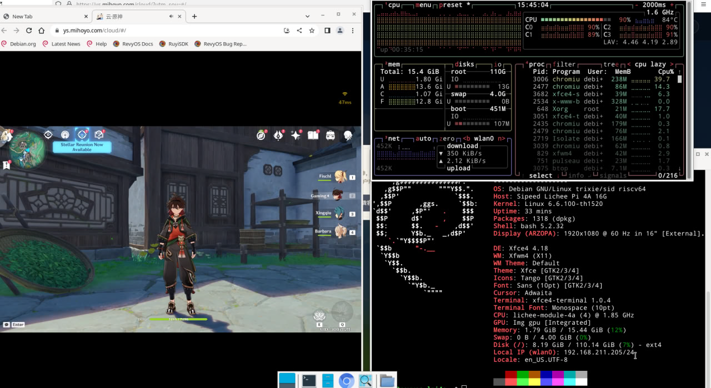

# Genshin-RevyOS-Test

Assess the smoothness of Cloud Genshin Impact running on Chromium bundled with the July 29 RevyOS image, benchmarked on LPI4A hardware.

---

## 测试环境

#### 系统信息

- 系统版本：RevyOS 20250729

- 参考安装文档：参考安装文档： [RevyOS安装文档](https://revyos.github.io/docs/)

#### 硬件信息

- Lichee Pi 4A (16GB RAM + 128GB eMMC)

#### 本次测试相关信息

- 测试时间：2025/08/31

- 测试内容：在lpi4a上测试云原神能不能在7月29号的revyos镜像上面的chromium流畅运行

---

## 测试方法

直接在刷入了RevyOS系统的Lichee Pi 4A上面使用chromium上打开云原神并且试玩，测试其稳定性和流畅性。

---

## 测试结果记录

在无线网络环境下，云原神平台下显示的网络延迟在40ms上下。游戏画质最低，选择流畅优先。CPU占用最高到百分之九十，温度上升到84°C。

游戏画面清晰流畅，声音清晰。在操作下，声音反馈及时，但是画面延迟非常高。平均有5s左右的延迟，导致几乎无法游玩。在firefox上无法打开云原神故无法对照测试
